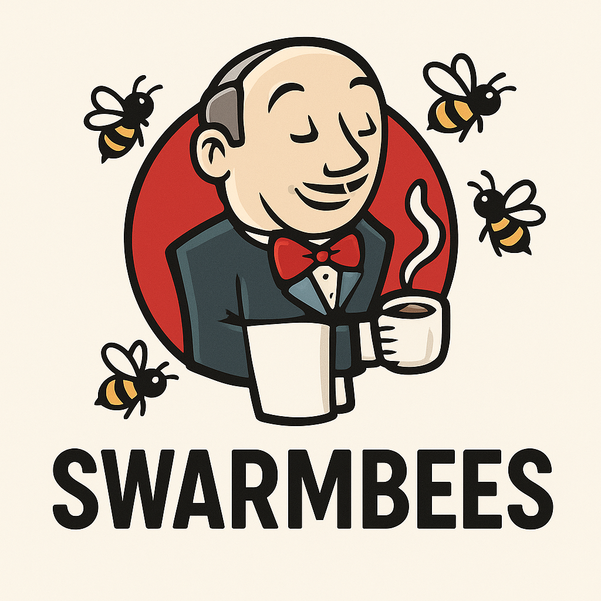

# 🐝 SwarmBees - Agentes Inteligentes para Jenkins



**Proyecto de integración de Jenkins con VS Code mediante Model Context Protocol**

---

## 📋 Índice

1. [¿Qué es este proyecto?](#qué-es-este-proyecto)
2. [De dónde nace la necesidad](#de-dónde-nace-la-necesidad)
3. [¿Qué hace actualmente?](#qué-hace-actualmente)
4. [Visión de futuro](#visión-de-futuro)
5. [Impacto en los equipos](#impacto-en-los-equipos)

---

## 🎯 ¿Qué es este proyecto?

Un conjunto de **agentes inteligentes especializados** que permiten interactuar con Jenkins directamente desde VS Code usando lenguaje natural.

### Componentes principales:

```
VS Code Copilot
    ↓
Agentes Especializados (@scout-bee, @doctor-bee, @worker-bee)
    ↓
Model Context Protocol (MCP)
    ↓
Jenkins
```

### 🐝 ¿Por qué "SwarmBees"?

El nombre del proyecto combina dos conceptos clave:

**Swarm** (Enjambre):
- Inspirado en **SwarmBuilder de Alexandria**, sistema de orquestación de agentes
- Hace referencia a **sistemas de agentes** que trabajan en conjunto
- Basado en arquitecturas de inteligencia colectiva donde múltiples agentes colaboran
- Refleja la visión de un sistema escalable con múltiples agentes especializados

**Bees** (Abejas):
- Guiño a **CloudBees**, empresa líder en soluciones Jenkins
- La metáfora de la colmena encaja perfectamente con CI/CD: trabajo constante, roles especializados, colaboración

**La metáfora de las abejas refleja cómo funciona el sistema:**

- **Especialización:** Como en una colmena real, cada abeja tiene un rol específico y bien definido
- **Eficiencia:** Cada agente se enfoca en lo que hace mejor, sin sobrecargas ni confusión
- **Colaboración:** Aunque trabajan independientemente, todos contribuyen al mismo objetivo (mantener el flujo CI/CD funcionando)
- **Trabajo constante:** Están siempre disponibles, monitoreando, diagnosticando y ejecutando

**Los agentes actuales:**

- 🔍 **Scout-bee** (Exploradora):
  
  
  
  Como las abejas exploradoras que buscan recursos, este agente monitorea y reporta el estado del sistema

- 🩺 **Doctor-bee** (Enfermera):
  
  
  
  Como las abejas enfermeras que cuidan la colmena, este agente diagnostica problemas y ayuda a mantener la salud del pipeline

- 💪 **Worker-bee** (Obrera):
  
  
  
  Como las abejas obreras que realizan el trabajo pesado, este agente ejecuta las tareas y builds

**En pocas palabras:** Habla con Jenkins como si hablaras con varios compañeros expertos, cada uno especializado en su área.

---

## 🔥 De dónde nace la necesidad

### Problemas actuales:

#### 1. **Fragmentación de Herramientas → Pérdida de Productividad**

**Antes:**
- 🖥️ **Jenkins** (navegador): Para revisar builds, logs y configuraciones
- 💻 **VS Code**: Para escribir y modificar código  
- 🤖 **IA/ChatGPT** (navegador): Para entender errores y buscar soluciones

**Flujo típico de un desarrollador:**
```
VS Code → Jenkins (navegador) → ChatGPT (navegador) → VS Code
    ↓           ↓                      ↓                  ↓
 Código      ¿Falló?              ¿Qué significa?      Arreglo
```

**Problema**: Cambio de contexto constante = **pérdida de concentración y tiempo**

**Ahora con este proyecto:**
```
VS Code + Copilot (TODO EN UN SOLO LUGAR)
    ↓
 "¿Por qué falló mi build?" → Respuesta inmediata con análisis
```

---

#### 2. **Falta de Autonomía → Dependencia Excesiva de DevOps**

**Los desarrolladores no pueden:**
- ❌ Interpretar logs complejos de Jenkins por sí mismos
- ❌ Identificar rápidamente la causa raíz de un error en pipeline
- ❌ Entender configuraciones de jobs y dependencias
- ❌ Distinguir si un problema es de código o de infraestructura

**Resultado**: Abren ticket a DevOps para preguntas básicas

**Con este proyecto:**
- ✅ **@doctor-bee** analiza logs y explica errores en lenguaje claro
- ✅ **@scout-bee** muestra el estado de jobs sin salir del IDE
- ✅ **@worker-bee** permite ejecutar builds con un comando simple
- ✅ Desarrolladores resuelven el **80% de problemas de forma autónoma**

---

#### 3. **Sobrecarga del Equipo DevOps → Costos Operativos**

**Incidencias típicas que recibe DevOps:**
- 🔴 "Mi build falló, ¿qué pasó?"
- 🔴 "¿Por qué no se despliega mi aplicación?"
- 🔴 "¿Puedes revisar este log?"
- 🔴 "Necesito lanzar un job pero no sé cómo"

**Realidad del equipo DevOps:**
- 👥 **Soportamos a múltiples equipos y proyectos** (desarrollo, QA, operaciones, infraestructura)
- 📬 **Alto volumen de solicitudes diarias** que compiten por atención
- ⏳ **Tiempos de espera variables**: desde 15-30 minutos en casos simples hasta **varias horas** si la incidencia es compleja o requiere investigación profunda
- 🔥 **Priorización constante**: incidencias de producción desplazan consultas de desarrollo

**Impacto:**
- ⏱️ **DevOps pierde 10-20 min** por incidencia simple (diagnóstico + explicación)
- ⏱️ **Desarrollador espera 30 min - 3 horas** dependiendo de la complejidad y carga del equipo
- 💰 **Costo de oportunidad**: Ambos equipos pierden tiempo en tareas básicas
- 😤 **Frustración mutua**: DevOps sobrecargado, desarrolladores bloqueados

**Con este proyecto - Beneficios para AMBOS equipos:**

**Para Desarrolladores:**
- ✅ **Respuestas instantáneas** (segundos en lugar de minutos/horas)
- ✅ **Autonomía** para resolver el 70-80% de problemas comunes
- ✅ **Cuando necesitan DevOps**, abren incidencias **mucho más precisas**:
  - "El job `appJava` build #45 falló en el paso 3 con error `ClassNotFoundException: suma()` - ya verifiqué que el método existe en `Calculator.java` línea 15, posible problema de classpath"
  - vs. "Mi build no funciona, ayuda 🆘"

**Para DevOps:**
- ✅ **Reducción del 60-70% en incidencias básicas**
- ✅ Las incidencias que llegan son **más complejas pero mejor documentadas**
- ✅ **Menos interrupciones**, más tiempo para trabajo estratégico
- ✅ **La herramienta también ayuda a DevOps** a diagnosticar rápidamente cuando intervienen

---

### 💰 Impacto Económico

El tiempo invertido en resolución de incidencias básicas, comunicación entre equipos y tiempos de espera tiene un **costo directo en productividad**. Este proyecto:

- **Reduce significativamente** las interrupciones y el tiempo de resolución
- **Aumenta la autonomía** de los equipos de desarrollo
- **Optimiza recursos** al liberar al equipo DevOps para trabajo de mayor valor
- **Genera retorno inmediato** al eliminar fricciones operativas diarias

El valor generado es continuo y escalable conforme más equipos adopten la herramienta.

---

### 🎯 La necesidad central:

> **"Unificar Jenkins, VS Code e IA en un solo entorno de trabajo, permitiendo a desarrolladores ser autónomos en diagnóstico de problemas y reduciendo drásticamente la carga operativa del equipo DevOps."**

---

## ✅ ¿Qué hace actualmente?

### 1. **Agentes especializados**

#### 🔍 **@scout-bee** - Monitoreo

- Lista jobs y su estado
- Consulta la cola de ejecución
- Revisa historial de builds
- Verifica estado de nodos

**Ejemplo:**
```
Usuario: "@scout-bee lista todos los jobs"
Scout: "📊 Tienes 2 jobs:
        - appJava (❌ Fallido)
        - test-build (❌ Fallido)"
```

#### 🩺 **@doctor-bee** - Diagnóstico

- Analiza builds fallidos
- Identifica causas raíz
- Revisa logs completos
- Detecta patrones de error

**Ejemplo:**
```
Usuario: "@doctor-bee analiza por qué falló appJava"
Doctor: "🔍 Diagnóstico:
         Error de compilación en línea 7:
         Método suma() no encontrado
         
         💡 Solución:
         Agregar el método public static int suma(int a, int b)"
```

#### 💪 **@worker-bee** - Ejecución

- Ejecuta jobs
- Detiene builds
- Controla la cola
- Gestiona parámetros

**Ejemplo:**
```
Usuario: "@worker-bee ejecuta appJava"
Worker: "✅ Build iniciado
         Queue ID: 27
         Build esperado: #11"
```

### 2. **Capacidades técnicas**

- ✅ Conexión en tiempo real con Jenkins vía MCP
- ✅ Autenticación con credenciales de usuario
- ✅ Lectura de configuraciones de jobs
- ✅ Análisis de logs y errores
- ✅ Ejecución y control de builds
- ✅ Consulta de estado del sistema

### 3. **Interacción natural**

```
VS Code Chat:
┌─────────────────────────────────────────┐
│ @scout-bee ¿hay builds corriendo?      │
│                                         │
│ No, no hay builds en ejecución          │
│ actualmente.                            │
│                                         │
│ @doctor-bee revisa el último error     │
│                                         │
│ 🔍 El build #10 falló por:             │
│ Error de compilación en App.java:7     │
│ ...                                     │
└─────────────────────────────────────────┘
```

---

## 🚀 Próximos Pasos

### 1. **Aumento de Agentes Especializados**

Expandir el ecosistema de agentes para cubrir más necesidades operativas:

- **@admin-bee** - Gestión de usuarios, permisos y roles en Jenkins
- **@performance-bee** - Monitorización de rendimiento, tiempos de build, uso de recursos
- **@architect-bee** - Creación y modificación de jobs y pipelines
- **@security-bee** - Auditoría de seguridad, análisis de vulnerabilidades
- **@reporter-bee** - Generación de reportes y métricas consolidadas

### 2. **Sistema de Agentes Orquestados - "The Hive"**

Evolucionar de agentes independientes a un **sistema colaborativo** donde los agentes se comunican entre sí:

**Concepto:**
- Los agentes trabajan en conjunto para resolver problemas complejos que requieren múltiples especialidades
- Un agente puede solicitar ayuda de otros para completar una tarea

**Agente Orquestador - @queen-bee (Abeja Reina):**
- Coordina las acciones de los demás agentes
- Decide qué agente(s) debe(n) intervenir según el problema
- Gestiona flujos de trabajo complejos que requieren múltiples pasos

**Ejemplo de flujo orquestado:**
```
Developer: "@queen-bee mi aplicación no arranca después del deploy"

Queen-bee coordina:
  1. @scout-bee → Verifica estado del deploy
  2. @doctor-bee → Analiza logs de la aplicación
  3. @performance-bee → Revisa recursos del servidor
  4. @security-bee → Verifica configuración de permisos
  
Queen-bee consolida: "Problema identificado: puerto 8080 ocupado 
                      por proceso anterior. Solución aplicada."
```

### 3. **Mejora de Prompts Especializados**

Refinamiento continuo de las instrucciones y capacidades de cada agente:

- Optimización del lenguaje natural en respuestas
- Mayor precisión en diagnósticos
- Respuestas más contextuales y específicas
- Mejor manejo de casos edge y errores complejos

### 4. **Contextualización con Información del Proyecto**

**Objetivo:** Que los agentes conozcan la realidad específica de cada organización.

**Implementación:**
- **Documentación de infraestructura:** Arquitectura, entornos, dependencias, configuraciones
- **Metodologías de desarrollo:** Estándares de código, flujos de trabajo, convenciones de nombrado
- **Mejores prácticas del equipo:** Patrones aprobados, soluciones recurrentes, decisiones arquitectónicas
- **Conocimiento histórico:** Problemas comunes y sus soluciones probadas

**Beneficio:**
- Soluciones **homogéneas** alineadas con los estándares del equipo
- Recomendaciones que respetan la arquitectura y metodología existente
- Respuestas que consideran el contexto específico del proyecto
- Reducción de soluciones "genéricas" que no encajan con el ecosistema

---

## 💼 Impacto en los equipos

### 👨‍💻 Para Desarrolladores

**Antes:**
- 5-10 cambios de contexto por día
- 2-3 minutos por consulta a Jenkins
- **Total: ~20-30 minutos perdidos/día**

**Después:**
- 0 cambios de contexto
- 10-20 segundos por consulta
- **Total: ~2-3 minutos/día**

**Ahorro: ~25 minutos/día por desarrollador**

### 🎓 Para Nuevos Desarrolladores

**Beneficios:**
- ✅ Curva de aprendizaje más suave
- ✅ Respuestas contextuales en lenguaje natural
- ✅ No necesitan aprender la UI de Jenkins inmediatamente
- ✅ Guiados por agentes especializados
- ✅ **Transparencia y sensación de control:** Los desarrolladores entienden qué está ocurriendo en tiempo real, generando confianza y reduciendo incertidumbre
- ✅ **Mayor motivación:** Especialmente para desarrolladores no familiarizados con Jenkins, la claridad y el acceso inmediato incrementan su confianza y proactividad

**Ejemplo:**
```
Junior: "@scout-bee ¿cómo veo el estado de mi deploy?"
Scout: "Tu deploy está en el job 'app-deploy'.
        Estado actual: ✅ Exitoso (hace 10 minutos)
        Deployed to: staging
        Version: 1.2.3"
```

### 🚀 Para DevOps/SRE

**Ventajas:**
- ✅ Menos interrupciones ("¿Por qué falló mi build?")
- ✅ Desarrolladores más autónomos
- ✅ Mejor visibilidad del sistema
- ✅ Facilita la adopción de mejores prácticas

### 🏢 Para la Organización

**Beneficios:**
- ✅ **Ahorro significativo de tiempo** que se traduce directamente en reducción de costos operativos
- ✅ Mayor satisfacción del equipo y mejor clima laboral
- ✅ Reducción de frustración y estrés en desarrolladores y DevOps
- ✅ Mejor calidad de código gracias a feedback más rápido
- ✅ Fortalecimiento de la cultura DevOps
- ✅ Escalabilidad: el valor aumenta conforme más equipos adoptan la herramienta

---

## 🎯 Casos de uso reales

### Caso 1: Debug rápido
```
Dev: "Mi build falló"
@doctor-bee: "Error de compilación en línea 145" (Recomendación de posibles soluciones).
Dev: "Gracias" [corrige en 30 segundos]
@worker-bee: "Re-ejecuto el build"
```
**Tiempo total: 2 minutos** (vs 15 minutos antes)

### Caso 2: Onboarding
```
Nuevo dev: "@scout-bee ¿qué jobs hay para frontend?"
Scout: "3 jobs de frontend:
        - frontend-build (CI)
        - frontend-deploy-staging
        - frontend-deploy-prod"

Nuevo dev: "@doctor-bee explica qué hace frontend-build"
Doctor: "Este job:
         1. Instala dependencias (npm install)
         2. Ejecuta tests (npm test)
         3. Build de producción (npm run build)
         Duración promedio: 3.5 minutos"
```
**Aprendizaje autónomo**

---

## 🛠️ Estado actual del proyecto

### ✅ Completado
- Servidor MCP funcional usando [mcp-jenkins](https://github.com/lanbaoshen/mcp-jenkins) (paquete de la comunidad)
- 3 agentes especializados (scout-bee, doctor-bee, worker-bee)
- Integración con VS Code
- Documentación completa

### 🚧 En progreso
- Testing con usuarios reales
- Recopilación de feedback
- Mejoras de UX

### 📋 Próximos pasos

1. **Desarrollo de MCP propio** - Crear un servidor MCP customizado específico para las necesidades del proyecto, reemplazando la dependencia del paquete externo mcp-jenkins
2. **Sistema de agentes orquestados** - Implementación de @queen-bee para coordinar múltiples agentes en problemas complejos
3. **Aumento de agentes especializados** - @admin-bee, @performance-bee, @architect-bee, @security-bee, @reporter-bee 
4. **Mejora de prompts** - Refinamiento continuo de las capacidades y respuestas de cada agente
5. **Contextualización del proyecto** - Nutrir agentes con documentación de infraestructura, metodología y mejores prácticas del equipo
6. **Notificaciones proactivas** - Alertas automáticas sobre builds, deploys y eventos relevantes
7. **Deploy en VPS** - Servidor centralizado para pruebas con equipos reales
8. **Métricas de uso** - Dashboard para medir impacto y adopción

---

**🐝 "Haciendo que Jenkins sea tan fácil como hablar con un compañero"**
